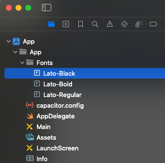
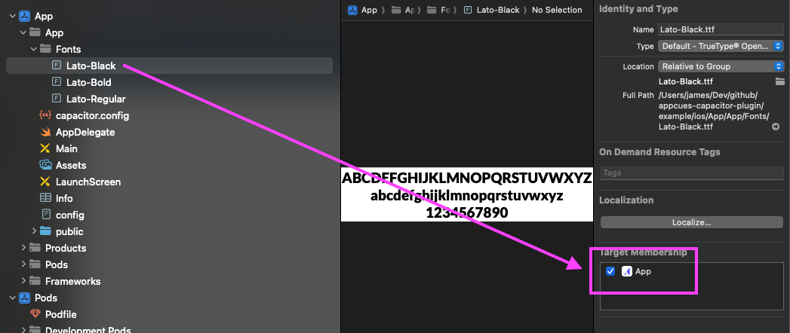
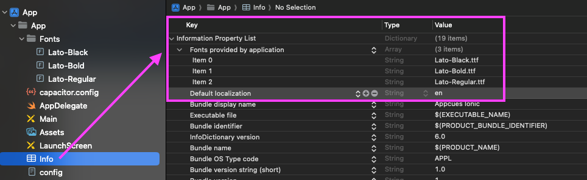
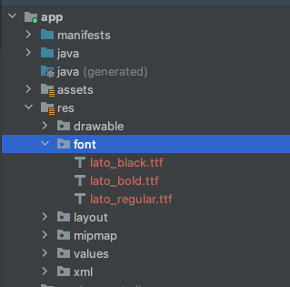

# Using Custom Fonts

To use custom fonts in Appcues Experiences that are rendering inside of Ionic applications, those fonts must be registered with the native iOS and Android projects for your app. Please follow the instructions in each section below to register the fonts.

## iOS

1. Open your Ionic application's iOS project workspace in Xcode - for example ./ios/App/App.xcworkspace
2. Under the root of the `App` project, create a `Fonts` group, and add all of the font files into this group.




3. Ensure that the font files are included in the target membership of the app project.




4. Open the `Info.plist` in the project and add a section for "Fonts provided by application". Add a row for each font and specify the matching font file name.




In source code view (xml) this section will look like:
```xml
<key>UIAppFonts</key>
<array>
    <string>Lato-Black.ttf</string>
    <string>Lato-Bold.ttf</string>
    <string>Lato-Regular.ttf</string>
</array>
```

For more information, please refer to [iOS Reference Documentation](https://developer.apple.com/documentation/uikit/text_display_and_fonts/adding_a_custom_font_to_your_app)

## Android

1. Open your Ionic application's Android project in Android Studio - for example ./android
2. Under the `app` module, navigate to the `res` (resources) folder, an add a `font` subdirectory, if not already there.
3. Add the font files into the `font` resource directory. Note, Android resource naming is all lower case, and any `-` should be replaced with `_`.




For more information, please refer to [Android Reference Documentation](https://developer.android.com/develop/ui/views/text-and-emoji/fonts-in-xml)


After the above steps are completed, create an Experience in the Appcues Mobile Builder that specifies a custom font, rebuild your application with these changes, and try it out in preview.